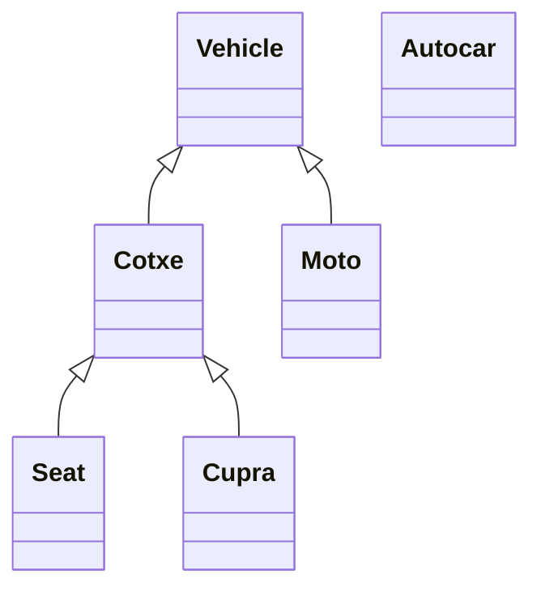
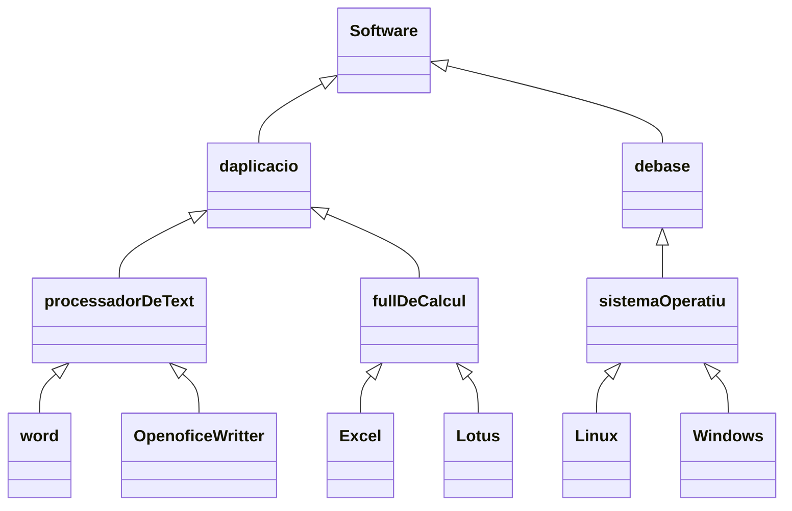

# 31-  POO: Herència

Ja hem vist que dues classes poden estar relacionades colaboran entre elles. Es a dir, a una d'elles vam definir una propietat del tipus de l'altra. Ara veurem un altre tipus de relacio entre classes que es l'herencia.

La herencia significa que podem crear noves clases partin de clases existents, que tindran totes les propietats i els metodes de la seva "super classe" o la "classe pare" i a més a més es podran afegir altres propietats i mètodes propis.


## La classe pare

Sería la classe de la que deriva o descendeix una classe. Les classes filles (descendents) hereden ( incorporen) automàticament les propietats i mètodes de la classe pare.

## Subclasse

Es la classe que descendeis d'una altra. Hereda automaticament els atributs i mètodes de la seva super classe. Es una especialització d'una altra classe.

Admeten la definició de nous atributs i mètodes per augmentar la especialització de la classe.

Imaginem la classe vehicle, quines classes podríam derivar d'ella?



Sempre cap avall a la jerarquía hi ha una espacialització. Les subclasses afegeixen noves propietats i mètodes.

Imaginem ara la classe software. Quines podem derivar d'ella?


El primer tipus de relació que hem vist entre dos classes era de colaboració. Recordem que es quan una classe contè un objecte d'una altra clase com atribut.

Cuan la relacio entre dos classes es del tipus "... te un ..." o "... es part de ...", no hem d'implementar herencia. Ja que estem daban una relació de colaboració de classes no d'hererncia.

Si tenim una classeA i una classeB i notem que entre elles existeis algun tipus de relació tipo "... tenen un ..." tampoc hem d'implementar herencia sino declarar la classeA un atribut de la classeB

Per exemple: tenim una classe cotxe, una classe roda i una classe volant. veiem que la relació entre elles es: Cotxe "... te 4..." Rodes, volant "... es part de ..." cotxe. Pero la classe cotxe no te que derivar ni de roda ni volant de cotxe perque la relació no es de tipus-subtipus sino de colaboració.

Hem de declarar a la classe cotxe 4 atributs de tipus roda i un de tipus volant.

Després, si veiem que dos classes responen a la pregunta classeA "..es un.." ClasseB es possible que hi hagi una relació d'eherencia

per exemple

```txt
Cotxe "es un" vehilce
Cercle "es una" figura
Ratoi "es un" DispositiuDeEntrada 
Suma "es una" Operacio
```

## [Exemple 1]()

El seguent exemple, plantejarem una classe Persona que contindrà dos propietats: nom i edat. Definirem com a responsabilitats que el constructor rebi el nom i l'edat.

A la funció main del programa definirem un objecte de la classe persona i cridarem els seus mètodes.

També declararem una segona classe anomenada treballador que heredi de la classe Persona i afegeixi una propietat salari i ensenyi si te que pagar impostos quan el salari superi els 1500

A la funció main també crearem un objecte de la classe treballador.
