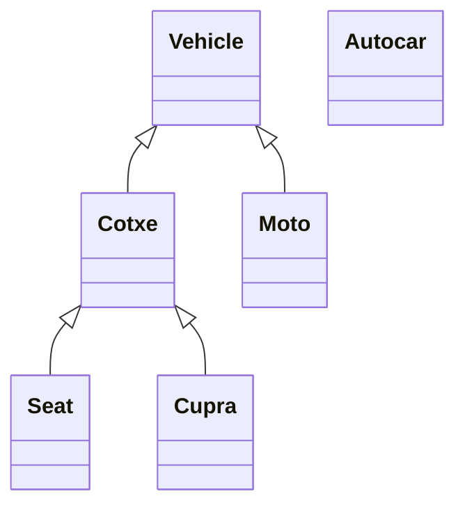
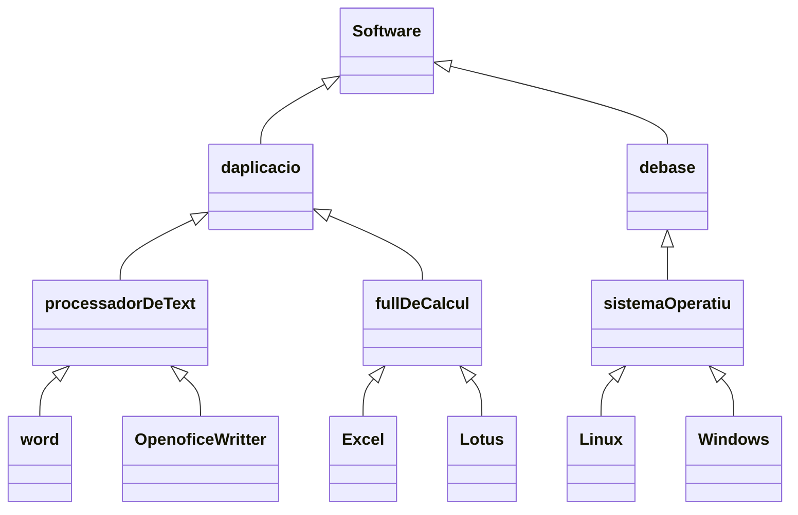

# 31-  POO: Herència

Ja hem vist que dues classes poden estar relacionades colaboran entre elles. Es a dir, a una d'elles vam definir una propietat del tipus de l'altra. Ara veurem un altre tipus de relacio entre classes que es l'herencia.

La herencia significa que podem crear noves clases partin de clases existents, que tindran totes les propietats i els metodes de la seva "super classe" o la "classe pare" i a més a més es podran afegir altres propietats i mètodes propis.


## La classe pare

Sería la classe de la que deriva o descendeix una classe. Les classes filles (descendents) hereden ( incorporen) automàticament les propietats i mètodes de la classe pare.

## Subclasse

Es la classe que descendeis d'una altra. Hereda automaticament els atributs i mètodes de la seva super classe. Es una especialització d'una altra classe.

Admeten la definició de nous atributs i mètodes per augmentar la especialització de la classe.

Imaginem la classe vehicle, quines classes podríam derivar d'ella?



Sempre cap avall a la jerarquía hi ha una espacialització. Les subclasses afegeixen noves propietats i mètodes.

Imaginem ara la classe software. Quines podem derivar d'ella?


El primer tipus de relació que hem vist entre dos classes era de colaboració. Recordem que es quan una classe contè un objecte d'una altra clase com atribut.

Cuan la relacio entre dos classes es del tipus "... te un ..." o "... es part de ...", no hem d'implementar herencia. Ja que estem daban una relació de colaboració de classes no d'hererncia.

Si tenim una classeA i una classeB i notem que entre elles existeis algun tipus de relació tipo "... tenen un ..." tampoc hem d'implementar herencia sino declarar la classeA un atribut de la classeB

Per exemple: tenim una classe cotxe, una classe roda i una classe volant. veiem que la relació entre elles es: Cotxe "... te 4..." Rodes, volant "... es part de ..." cotxe. Pero la classe cotxe no te que derivar ni de roda ni volant de cotxe perque la relació no es de tipus-subtipus sino de colaboració.

Hem de declarar a la classe cotxe 4 atributs de tipus roda i un de tipus volant.

Després, si veiem que dos classes responen a la pregunta classeA "..es un.." ClasseB es possible que hi hagi una relació d'eherencia

per exemple

```txt
Cotxe "es un" vehilce
Cercle "es una" figura
Ratoi "es un" DispositiuDeEntrada 
Suma "es una" Operacio
```

Un cop explicat això, podem explicar que a Kotlin, per crear una classe heredable es fa posant open daban de class:

```kotlin
open class SocUnaClasse(val valor: String, val edat: Int){}
```

Cuan definim una classe open hem de pensar seriament la definició de les seves propietats i mètodes, ja que si volem que un mètode es pugui reescriure en una subclasse hem de posar la paraula open també.

```kotlin
open class SocUnaClasse(val valor: String, val edat: Int){
	open fun socunmetode(){
	}
}
```

Cuan es fagin crides al objecte des del main o un altre, no afecta en res, tot segueix funcionan de la mateixa manera. El que cambia ho podem veure millor al següent exemple:

```kotlin
open class Vehicle(val marca: String, val anyFabricacio: Int) {
    open fun accelerar() {
        println("El vehicle s'està accelerant.")
    }

    open fun frenar() {
        println("El vehicle està frenant.")
    }
}

class Cotxe(marca: String, anyFabricacio: Int, val model: String) : Vehicle(marca, anyFabricacio) {
    override fun accelerar() {
        println("El cotxe $marca $model s'està accelerant.")
    }

    override fun frenar() {
        println("El cotxe $marca $model està frenant.")
    }

    fun aparcar() {
        println("El cotxe $marca $model està aparcant.")
    }
}

fun main() {
    val cotxe = Cotxe("Seat", 2022, "Ibiza")
    cotxe.accelerar()
    cotxe.frenar()
    cotxe.aparcar()
}
```
com pots veure, tenim una classe oberta que es diu Vehicle, que te dos propietats accelerar i aparcar, fins aqui a banda de la paraula open tot sembla igual a una classe com les que hem vist fins ara.

El que podem veure nou es cuan declarem la classe Cotxe que rep tres parametres, com pots veure la tercera es una propietat anomenada model que l'estem definin com a nova ja que conté la paraula val. L'herencia la indiquem després dels dos punts, indican el nom de la classe  de la cual heredem i passan inmediatament despres les dades del constructor de la classe.

Es a dir, la classe Cotxe te tres propietats, de les cuals dues son heredades i una es pròpia. Com que no hem posat open a la classe Cotxe, mes endavan no podrem declarar classes que heredin de la classe Cotxe. Si volguessim fer-ho nomes tindriam que posar-li la paraula open.

també quan revem un mètode heredat podem sobreescriurel tal i com vam veure a les [data class](https://github.com/marcmoiagese/curskotlin/tree/master/28-POO-data_class), en aquest exemple sobreescrivim la sortida d'accelerar i frenar per adecuarles a la nova realitat d'aquesta classe. La crida de les classes heredades es igual no cambia res del que ja hem vist fins ara.

Si definim una propietat, si auqesta es public, sera accesible des de les subclasses, pero si es private no. Hi ha una tercera propietat anomenada protected, que ens permet que una subclasse tingui acces a la propietat pero que no es tingui acces des d'on definim l'objecte d'aquella classe.

## [Exemple 1](https://github.com/marcmoiagese/curskotlin/blob/master/31-POO-Herencia/Exemple1/src/main/kotlin/Main.kt)

El seguent exemple, plantejarem una classe Persona que contindrà dos propietats: nom i edat. Definirem com a responsabilitats que el constructor rebi el nom i l'edat.

A la funció main del programa definirem un objecte de la classe persona i cridarem els seus mètodes.

També declararem una segona classe anomenada treballador que heredi de la classe Persona i afegeixi una propietat salari i ensenyi si te que pagar impostos quan el salari superi els 1500

A la funció main també crearem un objecte de la classe treballador.

## [Exemple 2](https://github.com/marcmoiagese/curskotlin/blob/master/31-POO-Herencia/Exemple2/src/main/kotlin/Main.kt)

Declararem una classe anomenada Calculadora que rebi al constructor dos valors de tipo Double. Fes que la classe sigui oberta per que sigui heredable. Definire, les responsabilitats de sumar, restar, multiplicar, dividir i imprimir.

Després declararem una classe anomenada CalculadoraCientifica que heredara Calculadora i li afegira les responsabilitats de calcular el cuadrat del primer numero i l'arrel cuadrada.

## Problemes

- Declarar una classe Dau que generi un valor aleatori entre 1 i 6, mostrar el seu valor. Crear una segona classe anomenada DauRecuadre que generi un valor entre 1 i 6, imprimir el valor dins un recuadre format per asteriscs.
  S'ha d'utilitzar l'herencia entre classes ( [Solució]() )
