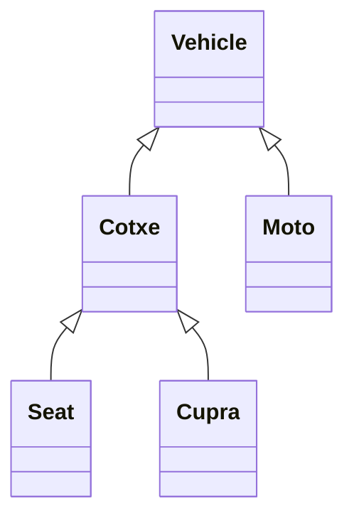

#31-  POO: Herència

Ja hem vist que dues classes poden estar relacionades colaboran entre elles. Es a dir, a una d'elles vam definir una propietat del tipus de l'altra. Ara veurem un altre tipus de relacio entre classes que es l'herencia.

La herencia significa que podem crear noves clases partin de clases existents, que tindran totes les propietats i els metodes de la seva "super classe" o la "classe pare" i a més a més es podran afegir altres propietats i mètodes propis.

## La classe pare

Sería la classe de la que deriva o descendeix una classe. Les classes filles (descendents) hereden ( incorporen) automàticament les propietats i mètodes de la classe pare.

## Subclasse

Es la classe que descendeis d'una altra. Hereda automaticament els atributs i mètodes de la seva super classe. Es una especialització d'una altra classe.

Admeten la definició de nous atributs i mètodes per augmentar la especialització de la classe.

Imaginem la classe vehicle, quines classes podríam derivar d'ella?

